# LHTask — Architektur & Funktionsweise

> Visualisierung der `lhtask`-Plugin-Mechanik in voller Tiefe. Alle Diagramme sind
> [Mermaid](https://mermaid.js.org/) und rendern direkt auf GitHub — keine externen Bilder.

Inhalt:

1. [Zwei Welten: Plugin-Repo vs. Ziel-Repo](#1-zwei-welten-plugin-repo-vs-ziel-repo)
2. [System-Überblick](#2-system-überblick)
3. [Der Lebenszyklus einer Idee](#3-der-lebenszyklus-einer-idee)
4. [Das `post-commit`-Routing](#4-das-post-commit-routing)
5. [Die Kette als Sequenz (Plan → Implement → Review)](#5-die-kette-als-sequenz)
6. [Worktree-Isolation der Implement-Stage](#6-worktree-isolation-der-implement-stage)
7. [Datei-Lebenszyklus & die Skip-Konvention](#7-datei-lebenszyklus--die-skip-konvention)
8. [Schleifen-Sicherheit (warum es nicht rekursiv explodiert)](#8-schleifen-sicherheit)
9. [Locking & Detached-Ausführung](#9-locking--detached-ausführung)
10. [Bootstrap: wie die Kette in ein Repo kommt](#10-bootstrap)
11. [Konfiguration als einzige Wahrheitsquelle](#11-konfiguration)

---

## 1. Zwei Welten: Plugin-Repo vs. Ziel-Repo

Das Wichtigste zuerst — der mentale Bruch, ohne den nichts Sinn ergibt:
**Die Skripte in `templates/` laufen hier nie.** Es sind parametrisierte Vorlagen, die
`bootstrap` per `cp -n` in ein *anderes* Repo kopiert. Erst dort laufen sie als git-Hook.

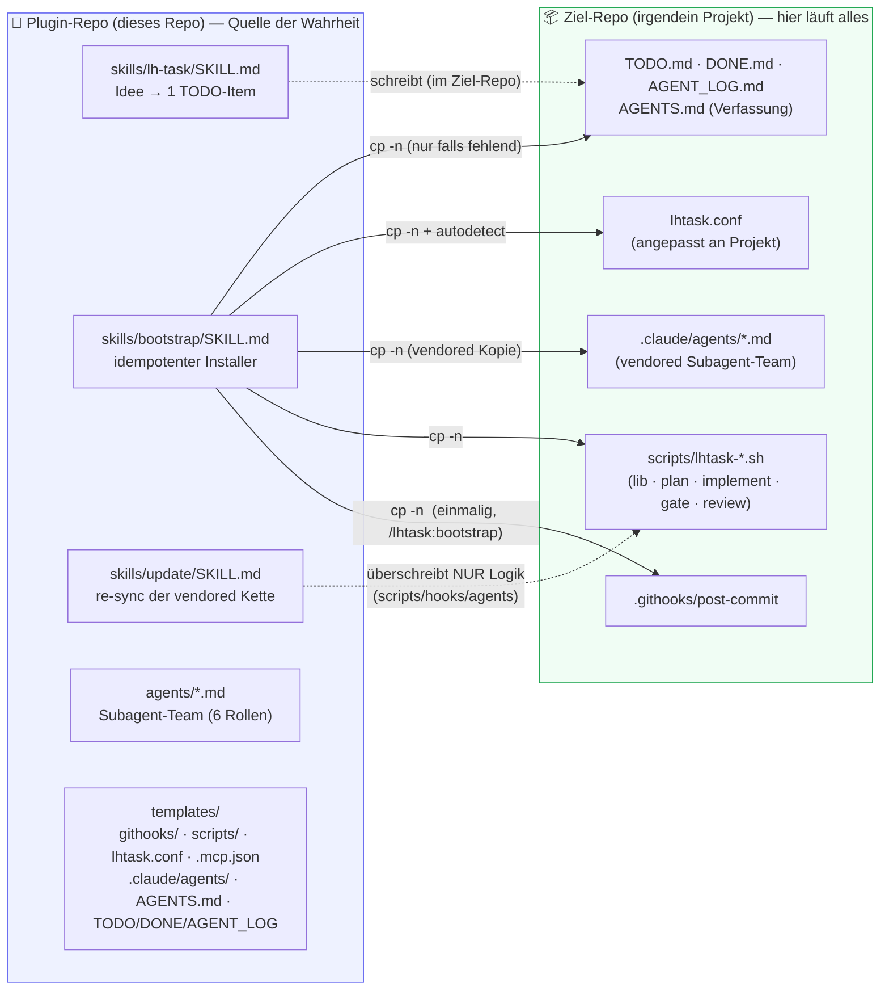

> Konsequenz: Ein Skript hier zu ändern, beeinflusst **jedes künftig gebootstrappte Repo** —
> aber **nicht** die git-Aktivität dieses Repos selbst. Bereits gebootstrappte Repos holt
> `/lhtask:update` nach (nur Logik; `lhtask.conf` + Lifecycle-Dateien bleiben unangetastet).
>
> `agents/` (Plugin-kanonisch, interaktiv) und `templates/.claude/agents/` (vendored, von der
> headless Kette per `--append-system-prompt` gelesen) müssen **identisch** bleiben —
> `agents/` ändern, dann `make sync-agents`. Gleiches gilt für `.mcp.json` /
> `templates/.mcp.json` (codegraph-MCP-Server).
>
> Die Skills registrieren die `/lhtask:*`-Slash-Commands **selbst** — ein `commands/`-Verzeichnis
> gibt es bewusst nicht mehr: Wrapper dort registrierten dieselben Namen und **überschatteten**
> die Skills (in v0.3.3 entfernt; `skills/` ist kanonisch).
>
> **Distribution** (verbindlich: [`docs/DISTRIBUTION.md`](docs/DISTRIBUTION.md)): installiert wird
> **ausschließlich über GitHub** — `claude plugin marketplace add leonhoffmann86/lhtask-plugin`,
> dann `claude plugin install lhtask@lhtask-marketplace` (das Marketplace-Manifest liegt dafür
> exakt unter `.claude-plugin/marketplace.json`). `--plugin-dir` ist nur zum Testen des Plugins
> selbst. Die Skills erzwingen das: Templates kommen aus `${CLAUDE_PLUGIN_ROOT}/templates`, mit
> Fallback auf die installierte Marketplace-Cache-Kopie — ein Dev-Checkout wird **nie** als
> Template-Quelle akzeptiert (ohne Installation stoppen sie mit der Install-Anweisung).
> Daten fließen einbahnig Plugin → Consumer; Updates sind pull-basiert (`/lhtask:update`
> im Ziel-Repo). Die Einbahnstraße gilt in beide Richtungen: Sessions im Consumer-Repo
> schreiben **nie** ins Plugin-Repo — bei einem Fund die vendored Kopie lokal fixen und
> den Befund *melden*, damit die Änderung plugin-seitig reviewt und released wird.

---

## 2. System-Überblick

Zwei Einstiegspunkte (Skills, vom Menschen aufgerufen) und eine dreistufige Kette
(Hooks, vom Commit ausgelöst).

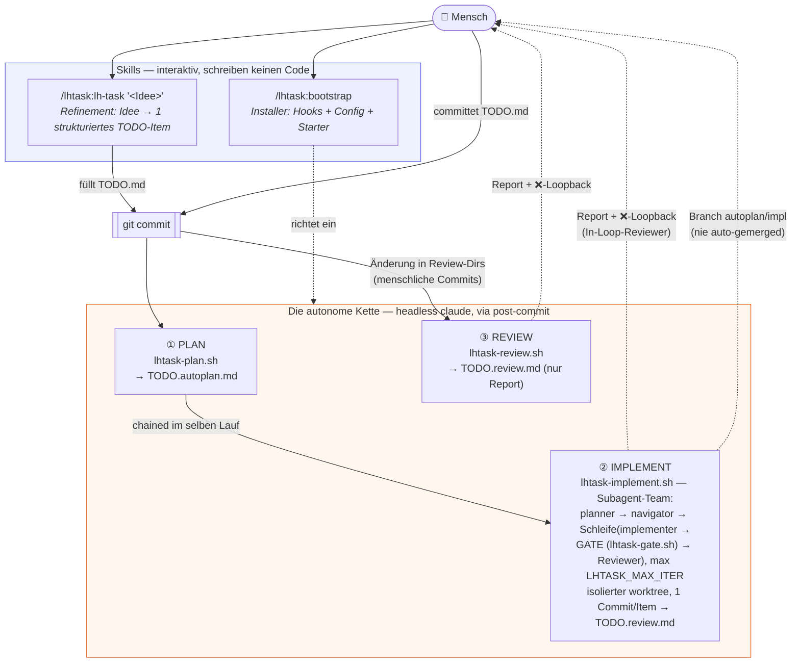

---

## 3. Der Lebenszyklus einer Idee

Von der vagen Notiz bis zum reviewten Branch — der „Happy Path“ aus Nutzersicht.

```mermaid
flowchart LR
    A["💡 vage Idee"] --> B["/lhtask:lh-task"]
    B --> C{"Frage oder<br/>Aufgabe?"}
    C -- "Frage" --> C1["aus Code beantworten"]
    C -- "Aufgabe" --> D["am echten Code erden<br/>(codegraph / Grep)"]
    D --> E["Risiko-Tier + Scope<br/>+ Done-Kriterium klären"]
    E --> F["1 strukturiertes Item<br/>in TODO.md"]
    F --> G[["git commit TODO.md"]]
    G --> H["① PLAN → TODO.autoplan.md"]
    H --> I["② IMPLEMENT<br/>(worktree, autoplan/impl)<br/>planner → navigator"]
    I --> J{"Risiko?"}
    J -- "hoch" --> K["🚧 Deferred<br/>(Mensch entscheidet)"]
    J -- "low/med" --> M["implementer: 1 Commit:<br/>Code + TODO→DONE + LOG"]
    M --> L{"GATE grün?<br/>(lint/type/test/build + fallow)"}
    L -- "❌ rot" --> M2["Loopback: nur die<br/>Findings fixen"]
    M2 --> M
    L -- "✅" --> RV{"Reviewer:<br/>blocker/major?"}
    RV -- "ja" --> M2
    RV -- "nein → DONE" --> O["TODO.review.md (Ampel)<br/>+ Branch bleibt stehen<br/>(LHTASK_DELIVERY=apply: Ergebnis<br/>gestaged im Arbeitsbaum, selbst committen)"]
    M2 -. "LHTASK_MAX_ITER erschöpft" .-> ESC["🔎 Review-Findings<br/>+ AGENT_LOG (eskaliert)"]
    O --> P{"Mensch:<br/>mergen?"}
    P -- "ja" --> Q["merge autoplan/impl"]
    P -- "nein" --> R["verwerfen"]

    style K fill:#fef2f2,stroke:#dc2626
    style ESC fill:#fffbeb,stroke:#d97706
    style M fill:#f0fdf4,stroke:#16a34a
    style Q fill:#f0fdf4,stroke:#16a34a
```

---

## 4. Das `post-commit`-Routing

Der Hook ist der Dispatcher. Er entscheidet anhand der **geänderten Dateien** im Commit,
welche Stage(s) laufen — und steigt bei Agent-Commits / Killswitch sofort aus.

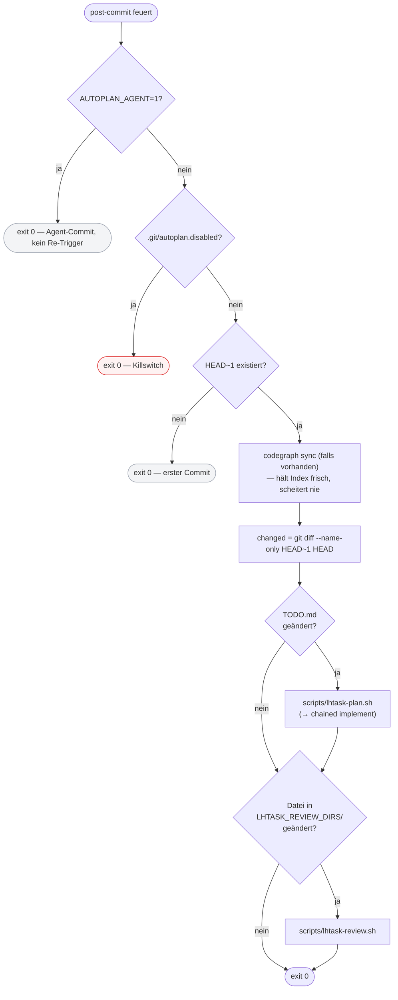

> Das Review-Regex wird dynamisch aus der Config gebaut:
> `review_re="^(${LHTASK_REVIEW_DIRS// /|})/"` → aus `"src tests"` wird `^(src|tests)/`.
>
> Die Plan-Stage steigt zusätzlich sauber aus (ohne claude-Lauf), wenn nach
> `lhtask_strip_skipped` **kein aktives Checkbox-Item** übrig ist — der Guard ist bewusst
> tolerant: `- [ ]`, `* [ ]` und nacktes `[ ]` zählen alle (ein falsches „nichts zu tun"
> blockiert still echte Arbeit — schlimmer als ein Leerlauf). Beispiel: der Commit eines
> applied/gemergten Ketten-Ergebnisses, dessen `TODO.md`-Änderung nur Items entfernt hat.

---

## 5. Die Kette als Sequenz

Der vollständige Ablauf eines `TODO.md`-Commits über alle Akteure hinweg — die Implement-Stage
orchestriert ein Subagent-Team (jede Rolle ein eigener headless `claude -p`-Aufruf, mit
Rollen-Body aus `.claude/agents/<rolle>.md` via `--append-system-prompt`) plus den
deterministischen Gate.

```mermaid
sequenceDiagram
    autonumber
    actor U as 👤 Mensch
    participant H as post-commit
    participant P as lhtask-plan.sh
    participant I as lhtask-implement.sh<br/>(Orchestrator, reine Shell)
    participant W as git worktree<br/>(autoplan/impl)
    participant C as headless claude<br/>(Rolle pro Aufruf)
    participant G as lhtask-gate.sh<br/>(deterministisch, kein LLM)

    U->>H: commit TODO.md
    H->>H: Guards (AGENT? disabled? HEAD~1?)
    H->>P: TODO.md geändert → starte Plan

    activate P
    P->>P: Lock nehmen · TODO.run.log resetten
    P->>P: lhtask_strip_skipped(TODO.md) → ACTIVE
    P->>C: Plan-Prompt (Verfassung + ACTIVE)
    C-->>P: TODO.autoplan.md (Sub-Steps + Risiko)
    P->>I: chain implement (selber detached Lauf)
    deactivate P

    activate I
    I->>W: git worktree add -f -B autoplan/impl HEAD
    Note over I,W: venv + codegraph.db symlinken ·<br/>.lhtask-state/ via info/exclude von Commits ausgeschlossen
    I->>C: Rolle PLANNER (read-only)
    C-->>I: .lhtask-state/plan.json (Risiko, Akzeptanzkriterien; high-risk → defer)
    I->>C: Rolle NAVIGATOR (read-only, codegraph)
    C-->>I: .lhtask-state/navigation.json (Konventionen, Blast Radius)
    loop bis LHTASK_MAX_ITER (default 3)
        I->>C: Rolle IMPLEMENTER (acceptEdits + Deny-Rules)
        C->>W: 1 Commit: Code + TODO→DONE + AGENT_LOG<br/>(high-risk → 🚧 Deferred, doc-only Commit)
        I->>G: GATE: lint / typecheck / test / build<br/>+ fallow (falls installiert)
        alt Gate rot
            G-->>I: gate.json + fallow.json (verdict fail) → Loopback mit Findings
        else Gate grün + LHTASK_REVIEW_AUTONOMOUS=1
            I->>C: Rolle REVIEWER-CORRECTNESS (read-only)
            I->>C: Rolle REVIEWER-CONVENTIONS (read-only)
            C-->>I: .lhtask-state/review-*.json (fail-closed geparst)
            alt blocker/major
                I->>I: Loopback mit Reviewer-Findings
            else sauber
                I->>I: STATUS=done → Schleife verlassen
            end
        end
    end
    Note right of C: jede Rolle läuft mit<br/>AUTOPLAN_AGENT=1 +<br/>Timeout (LHTASK_PHASE_TIMEOUT)<br/>+ eigenem Modell (LHTASK_MODEL_&lt;ROLLE&gt;<br/>→ LHTASK_MODEL → CLI-Default;<br/>openrouter:-Prefix → Proxy-Env pro Prozess)<br/>+ Live-Trace der Tool-Calls →<br/>TODO.run.log (LHTASK_STREAM, jq-gated)
    I->>I: LHTASK_DELIVERY=apply + konvergiert?<br/>lhtask_apply_impl: git merge --squash →<br/>Ergebnis GESTAGED im Arbeitsbaum (nie committet)<br/>sonst Fallback auf Branch (Grund wird surfaced)
    I->>I: lhtask_findings_surface: TODO.review.md (Ampel:<br/>Gate · Fallow · Model fallbacks · Reviews ·<br/>Delivery (bei apply) · Tooling)<br/>+ ❌→🔎 in TODO.md + AGENT_LOG
    I->>I: worktree entfernen (Branch bleibt!)<br/>nicht konvergiert → Eskalations-Note
    deactivate I
    I-->>U: "✅ x ⚠️ y ❌ z — siehe TODO.review.md"
    U->>U: git log autoplan/impl → mergen oder verwerfen<br/>(apply: gestagte Änderungen im IDE reviewen → selbst committen)
```

> Die In-Loop-Reviewer ersetzen den früheren terminalen `lhtask-review.sh`-Aufruf am Ende der
> Implement-Stage (der Hook kann Agent-Commits nicht reviewen, weil sie `AUTOPLAN_AGENT=1`
> setzen). `lhtask-review.sh` läuft weiterhin für **menschliche** Commits in den Review-Dirs —
> report-only, inklusive eines Fallow-Abschnitts (Report: `.git/lhtask-fallow.json`) und des
> `### Tooling`-Abschnitts.
> `LHTASK_REVIEW_AUTONOMOUS=0` schaltet die Reviewer-Phase ab (Gate-only-Schleife).
> Nur `gate.json` ist maschinen-vertrauenswürdig (von der Shell geschrieben); Agent-JSON wird
> jq-oder-grep und **fail-closed** gelesen (fehlend/kaputt = blocker → Loopback, nie stilles DONE).
> `reviewer-visual` ist als Scaffold dabei, aber noch **nicht** in die Schleife verdrahtet.
>
> **Fallow** (<https://docs.fallow.tools>) ist der fünfte deterministische Gate-Check: `fallow audit`
> (Dead Code / Duplikate / Komplexität), auf den Changeset des Item-Commits gescoped und
> „new-only" gegated — nur vom Change **eingeführte** Findings machen den Gate rot. Der Roh-Report
> landet als `.lhtask-state/fallow.json` neben `gate.json`; Loopback-Prompt und Reviewer lesen ihn
> mit. Graceful: nicht installiert → skip, Laufzeit-/Config-Fehler (exit 2) → skip, nie per `npx`
> nachgeladen (der Gate bleibt offline-deterministisch). Steuerung: `LHTASK_FALLOW` / `LHTASK_FALLOW_CMD`.
>
> **Cross-Vendor-Modelle** ([`docs/CROSS-VENDOR.md`](docs/CROSS-VENDOR.md)): ein Rollen-Modell der
> Form `openrouter:<vendor>/<model>` läuft auf einem **Nicht-Claude-Modell** hinter dem übersetzenden
> Proxy `LHTASK_PROXY_URL` (z. B. LiteLLM `/v1/messages` vor OpenRouter) — `ANTHROPIC_BASE_URL`/
> `ANTHROPIC_AUTH_TOKEN` werden **pro Rollen-Prozess** injiziert, Geschwister-Rollen bleiben auf der
> nativen API. Graceful **und laut**: Proxy unkonfiguriert/unerreichbar → Claude-Fallback; ein
> Cross-Vendor-Reviewer mit fehlendem/kaputtem Verdict-JSON bekommt **einen** Claude-Retry
> (`LHTASK_FORCE_CLAUDE=1`), bevor fail-closed greift. Jede Degradation wird protokolliert
> (`lhtask_model_fallback_note`) und als ❌ unter `### Model fallbacks` in `TODO.review.md`
> sichtbar (→ 🔎-Pointer + AGENT_LOG) — nie still.
>
> **Delivery** (`LHTASK_DELIVERY`, default `branch`): mit `apply` wird VOLL konvergierte Arbeit
> (Gate grün + Reviews ok) per `git merge --squash` als **gestagte, uncommittete Änderungen** in
> den Arbeitsbaum gelegt (`lhtask_apply_impl` in `lhtask-lib.sh`) — IDE-natives Review in der
> Changes-View, **der Mensch committet** (die Nie-auto-mergen-Invariante hält). Angewendet wird
> nur beweisbar konfliktfrei: der Impl-Branch sitzt exakt auf dem aktuellen HEAD **und** keine
> lokal uncommitteten Änderungen überlappen das Ergebnis; sonst Fallback auf den Branch-Modus
> mit Grund unter `### Delivery` (⚠️ zählt in die Ampel — nie still). Vorher selbst gestagte
> Arbeit wird beim Cleanup nie weggeresettet; der Branch bleibt in beiden Fällen als Backup
> stehen (hard-reset beim nächsten Lauf).
>
> **Tooling-Sichtbarkeit:** jede `TODO.review.md` (In-Loop-Surface **und** Standalone-Review) endet
> mit einem `### Tooling`-Abschnitt (`lhtask_tooling_to_md`): codegraph (Binary **und** Repo-Index),
> fallow, jq, timeout als ✅/⚠️ mit Install-Hinweis und konkretem Impact — dazu konditional `curl`
> (nur bei konfiguriertem Cross-Vendor-Modell, `lhtask_any_xvendor`; speist den Proxy-Probe) und
> der Desktop-Notifier (nur bei `LHTASK_NOTIFY=1`). Gate-Checks, die wegen eines **fehlenden
> Tools** übersprungen wurden, erscheinen als ⚠️ mit Install-/`LHTASK_GATE_<NAME>`-Hinweis
> (fallow: `LHTASK_FALLOW_CMD`) — generisch für alle Stack-Tools (eslint, tsc, ruff, pytest,
> cargo, …); „kein Kommando konfiguriert“ bleibt eine neutrale Notiz. Die Kette degradiert
> graceful, aber degradiertes Tooling wird **gemeldet**, nie verschwiegen — bewusstes `off`
> (`LHTASK_CODEGRAPH`/`LHTASK_FALLOW`) erscheint als neutrale Notiz, ⚠️ zählt in die Ampel.
> Die Ampel (`lhtask_surface_review`) zählt dabei nur **zeilenführende** ✅/⚠️/❌-Marker —
> ein ❌ mitten im Review-Prosa-Satz („no ❌ findings“) ist kein Finding und löst keinen
> falschen 🔎-Pointer aus (dessen `AGENT_LOG`-Append den Arbeitsbaum dirty machen und den
> nächsten apply-Delivery-Overlap-Check auslösen würde).

---

## 6. Worktree-Isolation der Implement-Stage

Warum die Implement-Stage **nie** den Arbeitsbaum berührt: Sie arbeitet in einem
wegwerfbaren `git worktree` auf einem eigenen Branch.

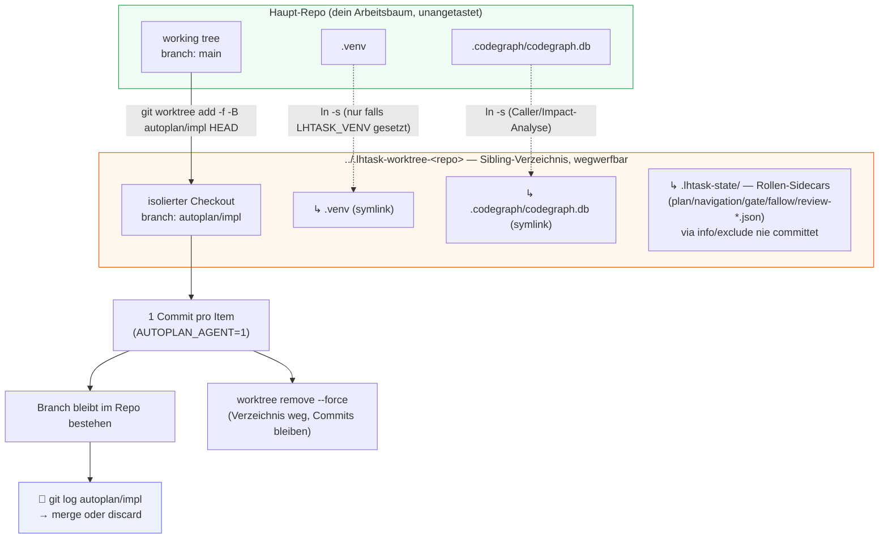

> Der worktree liegt als **Sibling-Verzeichnis neben dem Repo** (`../.lhtask-worktree-<repo>`),
> bewusst **nicht** unter `.git/`: die Agent-Permission-Schicht verweigert jeden Write unter
> einem `.git/`-Pfad automatisch — das brach Implementer-Läufe still (impl-error nach 0 Edits).
>
> **Vor** dem Anlegen wird hart aufgeräumt (`worktree remove --force` → `rm -rf` →
> `worktree prune`), damit eine verwaiste Registrierung eines abgebrochenen Laufs den
> neuen `worktree add` nicht blockiert.
>
> **Merge-Disziplin:** `-B` setzt den Branch bei jedem Lauf hart auf HEAD zurück, und die
> Schleife kann bis zu `LHTASK_MAX_ITER` ungemergte Commits hinterlassen — den Branch zeitnah
> reviewen und **mergen oder verwerfen**; ein liegengebliebener Branch wird beim nächsten Lauf
> überschrieben. Mit `LHTASK_DELIVERY=apply` entfällt das manuelle Mergen im Konvergenz-Fall:
> das Ergebnis liegt bereits **gestaged** im Arbeitsbaum (selbst committen), der Branch bleibt
> nur als Backup stehen.

---

## 7. Datei-Lebenszyklus & die Skip-Konvention

Welche Datei was bedeutet — und wie der Mensch mit drei Markierungen steuert, was die
Kette anfasst. `lhtask_strip_skipped` filtert vor jeder Plan-/Implement-Stage.

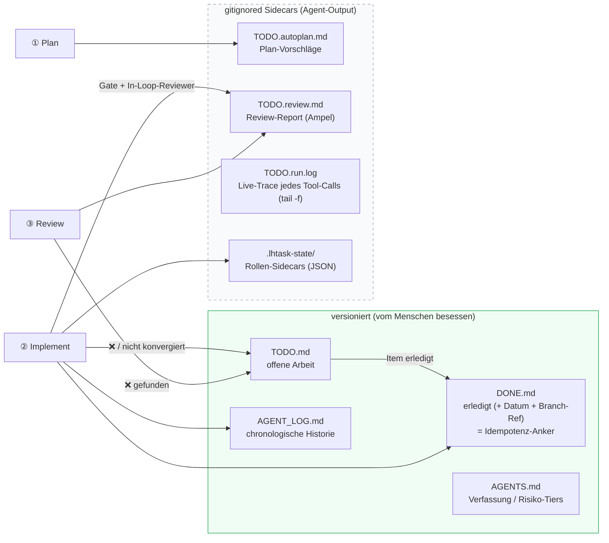

**Die Skip-Konvention in `TODO.md`** — was Plan/Implement **ignorieren**:

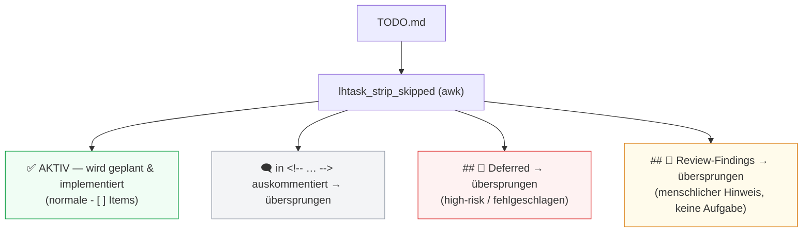

> Hebel für „nur dieses eine Item bearbeiten“: die anderen aktiven Items in einen
> `<!-- … -->`-Block oder unter `## 🚧 Deferred` verschieben.

---

## 8. Schleifen-Sicherheit

Die Kette committet selbst — und jeder Commit feuert wieder `post-commit`. Ohne Schutz
wäre das eine Endlosschleife. Der Schutz ist eine einzige Umgebungsvariable.

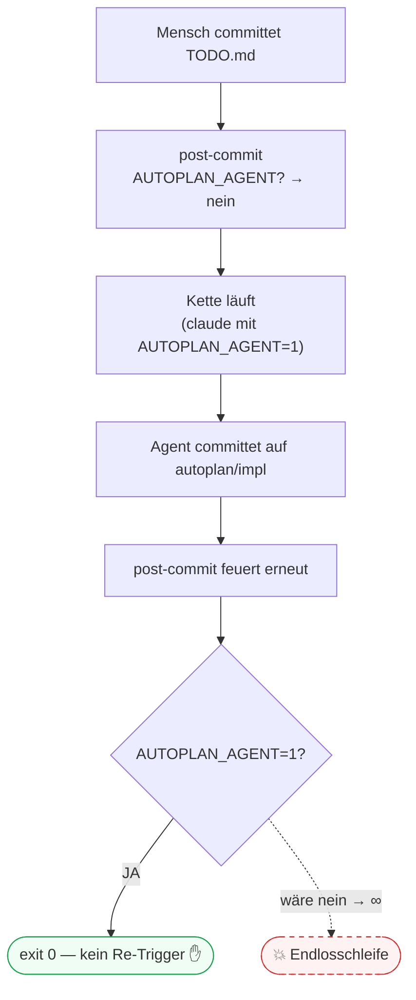

Zwei weitere Konsequenzen derselben Variable:

- Weil Agent-Commits den Hook überspringen, kann er die autonome Arbeit **nicht** selbst
  reviewen → deshalb laufen die **In-Loop-Reviewer** (correctness + conventions) direkt in
  der Implement-Schleife (`LHTASK_REVIEW_AUTONOMOUS=1`).
- `AUTOPLAN_AGENT=1` wird in `lhtask-implement.sh` **zentral in `run_phase`** gesetzt (nie pro
  Call-Site), und auch die Review-Stage setzt es defensiv — keine Rolle kann den Hook rekursieren.

Dazu kommen harte Deny-Rules für jede Rolle (`lhtask_deny_settings`, via `--settings`):
`git push` / `git reset --hard` / `git rebase` / `rm -rf` / Task / Agent sind verboten — Deny wird
zuerst ausgewertet und kann von keiner Ebene re-allowed werden. Reviewer/Planner/Navigator laufen
read-only (`dontAsk` + Allowlist), der Implementer commit-fähig (`acceptEdits`).

---

## 9. Locking & Detached-Ausführung

Jede Stage ist nebenläufigkeits-sicher und blockiert den Commit nicht.

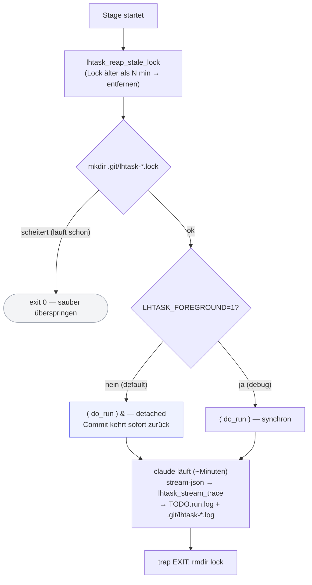

- `mkdir` als atomares Lock (ein Lauf gewinnt; Nebenläufer steigen sauber aus).
- `reap_stale_lock` verhindert, dass ein gekillter Lauf die Kette permanent blockiert
  (Plan/Review: 15 min, Implement: 30 min).
- Jede headless Phase läuft unter `timeout`/`gtimeout` (`LHTASK_PHASE_TIMEOUT`, default 600 s) —
  das begrenzt auch, wie lange der längere Implement-Lauf das Lock hält. Kein timeout-Tool
  installiert → Graceful No-op.
- **Detached by default** → der Commit kehrt sofort zurück, ein Platzhalter landet sofort
  im Sidecar. `LHTASK_FOREGROUND=1` ist der Debug-/Test-Hebel (synchron).
- **Live-Trace** (`LHTASK_STREAM`, default `auto`): jede headless Phase (Plan, alle
  Schleifen-Rollen, Standalone-Review) streamt ihre Tool-Calls per
  `--output-format stream-json` durch den jq-Renderer `lhtask_stream_trace` in `TODO.run.log`
  (`⚙ implementer → Edit: app/x.py` … `✔ implementer done — 7 turns`) — `tail -f TODO.run.log`
  ist damit eine Echtzeit-Statusansicht statt minutenlanger Stille („hängt er oder arbeitet
  er?"). Ohne jq oder mit `off` verhält sich alles exakt wie vor 0.9.0 (still bis Phasenende);
  Nicht-JSON-Zeilen (echte stderr-Fehler) bleiben wörtlich sichtbar.

---

## 10. Bootstrap

Wie die Kette einmalig in ein Repo eingebaut wird — idempotent, nichts wird stillschweigend überschrieben.

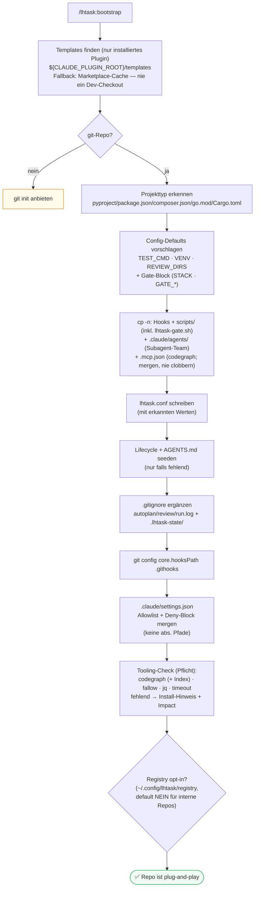

> Nach einem Plugin-Update bringt **`/lhtask:update`** die vendored Logik (Scripts, Hooks,
> Agents, ggf. `.mcp.json`-Merge) im Repo auf Stand — `lhtask.conf` und die Lifecycle-Dateien
> bleiben unangetastet; neue Config-Keys werden nur als Drift gemeldet, und derselbe
> Tooling-Report ist Pflichtteil jedes Updates. `--all` aktualisiert
> alle in `~/.config/lhtask/registry` registrierten Repos — die Registry wird dabei nur
> **konsumiert** (Registrieren ist ausschließlich Sache des Bootstrap, dort opt-in mit
> expliziter Nachfrage; `update` registriert nie selbst).

---

## 11. Konfiguration

`lhtask.conf` ist die **einzige Wahrheitsquelle**. Achtung: die Defaults sind an drei
Stellen dupliziert, die synchron bleiben müssen.

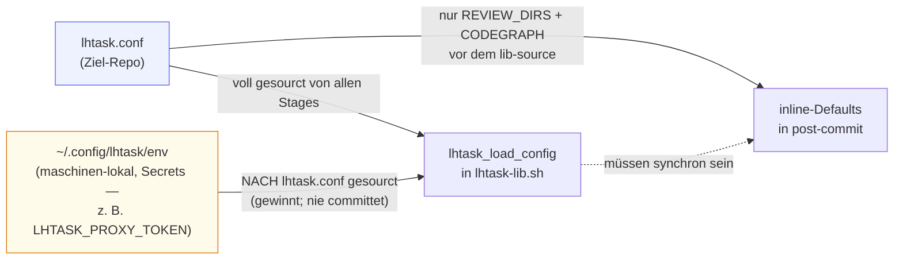

| Key | Bedeutung |
| --- | --- |
| `LHTASK_REVIEW_DIRS` | Dirs, deren Änderung die Review-Stage triggert (z. B. `src tests`) |
| `LHTASK_TEST_CMD` | Legacy-Testkommando; Fallback für `LHTASK_GATE_TEST`; `{path}` → Ziel |
| `LHTASK_CONSTITUTION_FILES` | Dateien, die jede Stage zuerst liest (default `AGENTS.md`) |
| `LHTASK_IMPL_BRANCH` | Branch der Implement-Stage (default `autoplan/impl`) |
| `LHTASK_DELIVERY` | `branch` (default: Ergebnis bleibt auf dem Impl-Branch) \| `apply` (VOLL konvergierte Arbeit wird per `git merge --squash` **gestaged** in den Arbeitsbaum gelegt — der Mensch committet; nicht beweisbar konfliktfrei → Fallback auf `branch` mit Grund unter `### Delivery`, Branch bleibt als Backup) |
| `LHTASK_VENV` | venv, das in den worktree gesymlinkt wird (Python); leer für Node/Go |
| `LHTASK_CODEGRAPH` | `auto` \| `on` \| `off` |
| `LHTASK_MODEL` | Globaler Modell-Override für headless-Läufe (leer = CLI-Default) |
| `LHTASK_MODEL_PLAN` / `_PLANNER` / `_NAVIGATOR` / `_IMPLEMENTER` / `_REVIEWER_CORRECTNESS` / `_REVIEWER_CONVENTIONS` / `_REVIEW` | Modell pro Rolle/Stage; Auflösung rollenspezifisch → `LHTASK_MODEL` → CLI-Default (`lhtask_model_flags [rolle]`, pro Phase in `run_phase` aufgelöst) — so können Implementer und Reviewer auf **verschiedenen** Modellen laufen (keine gemeinsamen Blind Spots). Ein Wert `openrouter:<vendor>/<model>` läuft die Rolle **cross-vendor** über den Proxy ([`docs/CROSS-VENDOR.md`](docs/CROSS-VENDOR.md)) |
| `LHTASK_PROXY_URL` | Anthropic-kompatibler übersetzender Proxy für `openrouter:`-Modelle (z. B. LiteLLM `/v1/messages`); leer/unerreichbar → Claude-Fallback, **laut** protokolliert (❌ `### Model fallbacks`) |
| `LHTASK_PROXY_TOKEN` | Auth-Token für den Proxy — **nicht** ins committete Conf: in `~/.config/lhtask/env` setzen (nach `lhtask.conf` gesourct, gewinnt) |
| `LHTASK_REVIEW_AUTONOMOUS` | `1` = In-Loop-Reviewer in der Implement-Schleife (`0` = Gate-only) |
| `LHTASK_NOTIFY` | `1` = Desktop-Notification bei Review-Ende (kein Notifier installiert → ⚠️ im Tooling-Report) |
| `LHTASK_STACK` | Stack für den Gate: `auto` (Marker-Dateien) \| `nextjs` \| `react` \| `node` \| `python` \| `php` \| `go` \| `rust` |
| `LHTASK_GATE_LINT` / `_TYPECHECK` / `_TEST` / `_BUILD` | Gate-Kommandos je Check; leer = Stack-Default (Test: Fallback `LHTASK_TEST_CMD`); fehlendes Tool = skip, im Report als ⚠️ mit Install-Hinweis |
| `LHTASK_FALLOW` | Fallow-Static-Analysis als fünfter Gate-Check: `auto` (läuft, falls installiert — PATH oder `./node_modules/.bin`) \| `off` |
| `LHTASK_FALLOW_CMD` | Volles fallow-Kommando-Override (`{base}` → Basis-Ref); leer = `fallow audit --base {base} --gate new-only --format json --quiet` |
| `LHTASK_MAX_ITER` | Max. Iterationen der implement↔gate↔review-Schleife (default 3) |
| `LHTASK_PHASE_TIMEOUT` | Timeout (s) pro headless `claude -p`-Phase (default 600) |
| `LHTASK_STREAM` | Live-Trace der Agent-Tool-Calls in `TODO.run.log`: `auto` (default; braucht jq — ohne jq wie `off`) \| `off` (Phase still bis zum Ende, Verhalten vor 0.9.0) |
| `LHTASK_VISUAL_MAX_DIFF_RATIO` / `LHTASK_DEV_URL` | Stage 2 (visual reviewer — Scaffold, noch nicht verdrahtet) |

---

### Debugging-Spickzettel

```bash
tail -f TODO.run.log                        # Live-Trace jedes Agent-Tool-Calls (pro Trigger resettet)
LHTASK_FOREGROUND=1 .githooks/post-commit   # getriggerte Stage synchron ausführen
cat .git/lhtask-implement.log               # roher Per-Stage-Log
touch .git/autoplan.disabled                # Killswitch (entfernen = wieder an)
bash tests/smoke-test.sh                    # Smoke-Test: Unit-Teil (Modell-Auflösung + Tooling-Surface + apply-Delivery + Plan-Idle-Guard + Ampel-Zählung + Live-Stream-Trace, ohne claude) + E2E (Wegwerf-Repo, braucht claude-CLI)
```
