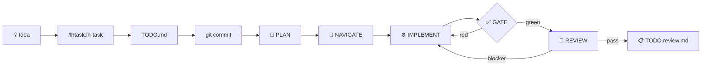

# LHTask — Autonomous TODO Workflow for Claude Code

[](https://opensource.org/licenses/MIT)
[](https://github.com/leonhoffmann86/lhtask-plugin)
[](https://claude.ai/code)

**Turn a rough idea into a reviewed, tested implementation — automatically.**

LHTask gives Claude Code a three-stage autonomous workflow: refine an idea into a
structured task, then let a git-hook chain **plan → implement → review** it.
The implementer runs as a subagent team (planner, navigator, implementer,
deterministic gate, reviewers — in a bounded loop) inside an isolated worktree
on a branch that is **never auto-merged** — or, opt-in (`LHTASK_DELIVERY=apply`),
converged work lands as **staged changes** that *you* commit. A deterministic gate
(lint/typecheck/test/build, plus [fallow](https://docs.fallow.tools) static
analysis when installed) and fail-closed reviewers catch problems before you
ever see them. Language-agnostic and config-driven, so it drops into any repo.



## How it works (30 seconds)

1. **Capture** — `/lhtask:lh-task "your idea"` refines it into one structured `TODO.md` item.
2. **Commit** — `git add TODO.md && git commit -m "task: …"` triggers the chain.
3. **Done** — The chain plans, implements, gates, and reviews. You get a `TODO.review.md`
   with findings. Nothing is auto-merged — you stay in control.

## Install & use

```bash
# one-time (GitHub is the only install channel — see docs/DISTRIBUTION.md):
claude plugin marketplace add leonhoffmann86/lhtask-plugin
claude plugin install lhtask@lhtask-marketplace

# inside any repo you want to enable:
/lhtask:bootstrap                               # writes hooks + lhtask.conf + starters
/lhtask:lh-task "your idea"                     # capture the first task
git add TODO.md && git commit -m "task: ..."    # starts the chain
```

Pick up a new release later: `claude plugin marketplace update lhtask-marketplace &&
claude plugin update lhtask`, then `/lhtask:update` inside each bootstrapped repo.

Kill switch: `touch .git/autoplan.disabled` · live trace: `tail -f TODO.run.log`.

## Security

LHTask installs a git `post-commit` hook that launches headless `claude` processes.
This is powerful — and taken seriously:

| Concern | How LHTask addresses it |
|---------|------------------------|
| **Unintended recursion** | Agent commits are flagged with `AUTOPLAN_AGENT=1`; the hook skips them — no infinite loops |
| **Destructive operations** | `git push`, `git reset --hard`, `git rebase`, `rm -rf`, `Task`/`Agent` delegation — hard-denied per role via `--settings` |
| **Escaping the sandbox** | Planner, navigator, and reviewers are **read-only** (`dontAsk` + allowlist); only the implementer is commit-capable |
| **Runaway agents** | Bounded loop: max 3 implement→gate→review iterations per run |
| **Stuck locks** | `mkdir`-based locks with automatic stale-reaping prevent deadlocks from killed runs |
| **Emergency stop** | `touch .git/autoplan.disabled` — instant kill switch for the entire chain |
| **Human oversight** | The impl branch is **never auto-merged**; opt-in `apply` delivery only *stages* converged work — the commit is always yours; high-risk items are deferred to `## 🚧 Deferred` and never touched autonomously |
| **Silent degradation** | Cross-vendor model fallbacks and every missing tool the chain touches (codegraph, fallow, jq, timeout, gate tools like eslint/pytest, curl & notifier when relevant) are reported in every `TODO.review.md` (`### Model fallbacks` / `### Tooling`) — graceful, never silent |

> **Before installing any git-hook-based plugin**, audit its scripts and understand
> what it does on your machine. LHTask is MIT-licensed and the full source is right here.
> Start with [`templates/githooks/README.md`](templates/githooks/README.md) for a
> stage-by-stage walkthrough of the installed chain.

## Documentation

The deep documentation is the source of truth and stays current automatically (see *Doc
automation* below) — start here:

- **[ARCHITECTURE.md](ARCHITECTURE.md)** — full visual deep-dive (Mermaid diagrams of the chain, routing, worktree isolation, skip convention, loop-safety).
- **[CLAUDE.md](CLAUDE.md)** — agent-native source of truth: the mental model and the load-bearing invariants for anyone editing the chain.
- **[skills/lh-task/SKILL.md](skills/lh-task/SKILL.md)** — the idea → one structured TODO item refinement workflow.
- **[skills/bootstrap/SKILL.md](skills/bootstrap/SKILL.md)** — the idempotent installer that scaffolds the chain into a repo.
- **[skills/update/SKILL.md](skills/update/SKILL.md)** — re-syncs the vendored chain in bootstrapped repos after a plugin update.
- **[templates/lhtask.conf](templates/lhtask.conf)** — the single config (review dirs, gate commands, impl branch, max iterations, per-role models — optionally cross-vendor, …).
- **[templates/AGENTS.md](templates/AGENTS.md)** — the starter *constitution* whose risk tiers the autonomous implementer obeys.
- **[templates/githooks/README.md](templates/githooks/README.md)** — what the installed `post-commit` chain does, stage by stage.
- **[docs/DISTRIBUTION.md](docs/DISTRIBUTION.md)** — the binding distribution & separation model (GitHub-only install, one-way data flow, pull-based updates).
- **[docs/CROSS-VENDOR.md](docs/CROSS-VENDOR.md)** — run individual roles (ideally the reviewers) on a non-Claude model via a translating proxy; degradation is graceful but never silent.

## Doc automation

`ARCHITECTURE.md`, `CLAUDE.md` and this README stay in sync with the code via a `pre-push` hook:
when a push changes any **source** file (everything tracked except the generated docs and editor
noise — so new files can't be forgotten), it regenerates the docs (headless `claude`), commits
them, and pushes that commit along — one `git push`, fresh docs included.

```bash
make setup            # one-time per clone: activate the hook + make scripts executable
make docs             # regenerate the docs on demand
make check            # syntax-check the shell scripts
make                  # list all commands

LHTASK_DOCS_SKIP=1 git push           # skip the refresh for one push
touch .git/docs-refresh.disabled      # disable it entirely (rm to re-enable)
```

## Built by

**Leon Hoffmann** — freelance web developer & AI-integration consultant (Berlin).
I build tools that bridge human intent and autonomous execution.

- 🌐 [leonhoffmann.net](https://leonhoffmann.net)
- 💼 [GitHub](https://github.com/leonhoffmann86)

*LHTask is MIT-licensed. If it saves you time, I'd love to hear about it —
and if you need custom AI workflow integration, I'm available for consulting.*